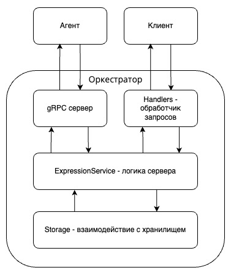

# Распределенный вычислитель арифметических выражений. Финальная задача

### Проект

Отправная точка: http://localhost:8080/

## Техническое задание
<details>
  <summary><color>ТЗ второго спринта</color></summary>
  
  Пользователь хочет считать арифметические выражения. Он вводит строку 2 + 2 * 2 и хочет получить в ответ 6. Но наши операции сложения и умножения (также деления и вычитания) выполняются "очень-очень" долго. Поэтому вариант, при котором пользователь делает http-запрос и получает в качетсве ответа результат, невозможна. Более того: вычисление каждой такой операции в нашей "альтернативной реальности" занимает "гигантские" вычислительные мощности. Соответственно, каждое действие мы должны уметь выполнять отдельно и масштабировать эту систему можем добавлением вычислительных мощностей в нашу систему в виде новых "машин". Поэтому пользователь, присылая выражение, получает в ответ идентификатор выражения и может с какой-то периодичностью уточнять у сервера "не посчиталость ли выражение"? Если выражение наконец будет вычислено - то он получит результат. Помните, что некоторые части арфиметического выражения можно вычислять параллельно.

Back-end часть

Состоит из 2 элементов:

Сервер, который принимает арифметическое выражение, переводит его в набор последовательных задач и обеспечивает порядок их выполнения. Далее будем называть его оркестратором.
Вычислитель, который может получить от оркестратора задачу, выполнить его и вернуть серверу результат. Далее будем называть его агентом.

#### Оркестратор
Сервер, который имеет следующие endpoint-ы:

- Добавление вычисления арифметического выражения.
```go
curl --location 'localhost:8080/api/v1/calculate' \
--header 'Content-Type: application/json' \
--data '{
  "expression": <строка с выражение>
}'
```
- Получение списка выражений со статусами.
```go
curl --location 'localhost:8080/api/v1/expressions'
```
- Получение выражения по его идентификатору
```go
curl --location 'localhost:8080/api/v1/expressions/:id'
```
- Получение задачи для выполнения.
```go
curl --location 'localhost:8080/internal/task'
```
- Приём результата обработки данных.
```go
curl --location 'localhost:8080/internal/task' \
--header 'Content-Type: application/json' \
--data '{
  "id": 1,
  "result": 2.5
}'
```

#### Агент
Демон, который получает выражение для вычисления с сервера, вычисляет его и отправляет на сервер результат выражения. При старте демон запускает несколько горутин, каждая из которых выступает в роли независимого вычислителя. Количество горутин регулируется переменной среды.
</details>

<details>
  <summary><color>ТЗ на финал</color></summary>
Продолжаем работу над проектом Распределенный калькулятор арифметических выражений.
В этой части работы над проектом реализуем персистентность (возможность программы восстанавливать свое состояние после перезагрузки) и многопользовательский режим.
Простыми словами: все, что мы делали до этого теперь будет работать в контексте пользователей, а все данные будут храниться в СУБД

#### Функционал
 Добавляем регистрацию пользователя
- Пользователь отправляет запрос
```go
POST /api/v1/register {
"login": ,
"password":
}
```
В ответ получае 200+OK (в случае успеха). В противном случае - ошибка

 Добавляем вход
- Пользователь отправляет запрос
```go
POST /api/v1/login {
"login": ,
"password":
}
```
В ответ получает 200+OK и JWT токен для последующей авторизации.

- Весь реализованный ранее функционал работает как раньше, только в контексте конкретного пользователя.
За эту часть можно получить 20 баллов
- У кого выражения хранились в памяти - переводим хранение в SQLite. (теперь наша система обязана переживать перезагрузку)
За эту часть можно получить 20 баллов
- У кого общение вычислителя и сервера вычислений было реализовано с помощью HTTP - переводим взаимодействие на GRPC
За эту часть можно получить 10 баллов

Дополнительные баллы:
- за покрытие проекта модульными тестами можно получить бонусные 10 баллов
- за покрытие проекта интеграционными тестами можно получить бонусные 10 баллов

Правила оформления:
- Проект размещен на github
- Проект снабжен Readme фалом - где подробно описано, о чем проект и как им пользоваться
- Проект снабжён примерами использования с помощью curl (который покрывает разные сценарии: всё хорошо, ошибки)
```go
curl --location 'localhost/api/v1/calculate' \
--header 'Content-Type: application/json' \
--data '{
  "expression": "2+2*2"
}'
```
- Отдельным блоком в документации идёт инструкция по запуску проекта (желательно, чтобы можно было просто скопировать какую-то команду и запустить ей проект)
```go
go run ./cmd/calc_service/...
```
</details>

## Описание
Проект представляет собой систему из двух основных сервисов: **Оркестратор** и **Агент**.

**Оркестратор** выполняет следующие функции:
*   Предоставляет HTTP API для пользователей для регистрации, аутентификации и отправки арифметических выражений.
*   Принимает арифметические выражения, парсит их и разбивает на более мелкие подзадачи.
*   Управляет очередью этих подзадач.
*   Предоставляет gRPC API для агентов, чтобы они могли запрашивать подзадачи для вычисления.
*   Сохраняет выражения и их статусы (в ожидании, в процессе, вычислено, ошибка) в базе данных.

**Агент**:
*   Подключаются к Оркестратору по gRPC.
*   Запрашивают доступные подзадачи.
*   Выполняют вычисления (сложение, вычитание, умножение, деление) для полученных подзадач. Время выполнения каждой операции настраивается.
*   Отправляют результат обратно Оркестратору по gRPC.
*   Агенты могут работать параллельно, используя несколько воркеров .

Взаимодействие пользователя с системой происходит через HTTP API Оркестратора, а вычисления выполняются распределенно Агентами через gRPC.

## Запуск проекта: 
- Склонируйте репозиторий
```sh
git clone https://github.com/neandrson/go-daev2-final.git
```
- Перейдите в корневой каталог проекта
```sh
cd go-daev2-final
```
- Создайте файл `.env` в корневой директории проекта, скопировав содержимое из `.env.example`:
```sh
cp .env.example .env
```
Вы можете изменить следующие переменные окружения:
*   `ORCHESTRATOR_PORT`: Порт для HTTP сервера Оркестратора (по умолчанию `8080`).
*   `TASKS_PORT`: Порт для gRPC сервера Оркестратора, к которому подключаются Агенты (по умолчанию `50051`).
*   `SECRET_KEY`: Секретный ключ для генерации и проверки JWT токенов аутентификации.
*   `AUTH_TOKEN_TTL`: Время жизни JWT токена (по умолчанию `1h`).
*   `TIME_ADDITION_MS`, `TIME_SUBTRACTION_MS`, `TIME_MULTIPLICATIONS_MS`, `TIME_DIVISIONS_MS`: Время выполнения арифметических операций в миллисекундах для Агента (по умолчанию `1s`).
*   `AGENT_COMPUTING_POWER`: Количество параллельных воркеров у Агента для обработки задач (по умолчанию `10`).
Пожалуйста, дождитесь сообщения о том, что сервер начал работу. На моей машине этот процесс занимает заметное время.
- Запустите Оркестратор:
```sh
go run orchestrator/cmd/main.go
```
- Запустите Агента:
```sh
go run agent/cmd/main.go
```
## Инструкция по использованию
Взаимодействие с API Оркестратора требует аутентификации по JWT токену для большинства эндпоинтов.
```go
curl --location 'http://localhost:8080/api/v1/calculate' \
--header 'Content-Type: application/json' \
--header 'Authorization: Bearer сгенерированный_токен_после_входа' \
--data '{
    "expression": "выражение"
}'
```
## Примеры:
Статусы решений:<br>
`solved` - завершено<br>
`in progress` - в процессе вычисления<br>
`invalid` - нет решения<br>

- Запрос для регистрации пользователя:
```go
curl --location 'http://localhost:8080/api/v1/register' \
--header 'Content-Type: application/json' \
--data '{
    "login": "guest",
    "password": "guest"
}'
```
В случае успеха вы получите статус `200 OK`.

- Запрос для входа пользователя:
```go
curl --location 'http://localhost:8080/api/v1/login' \
--header 'Content-Type: application/json' \
--data '{
    "login": "guest",
    "password": "guest"
}'
```
Ответ:
```json
{
    "access_token": "сгенерированный_токен_после_входа"
}
```
- Запрос на решение выражения:
```go
curl --location "http://localhost:8080/api/v1/calculate" \
--header "Authorization: Bearer сгенерированный_токен_после_входа" \
--header "Content-Type: application/json" \
--data "{
    \"expression\": \"2+2*2/4\"
}"
```
В ответ вы получите ID созданного выражения:
```json
{
    "id": 1
}
```
- Запрос на получение всех решенных (и не только) примеров для определенного пользователя:
```go
curl --location "http://localhost:8080/api/v1/expressions" \
--header "Authorization: Bearer сгенерированный_токен_после_входа"
```
Ответ:
```json
[
  {
    "id": 1,
    "status": "solve",
    "result": 9
  },
  {
    "id": 2,
    "status": "error division by zero",
    "result": 0
  }
]
```
- Запрос на получение выражения по его id:
Отправьте GET-запрос на `/api/v1/expressions/{id}`, где `{id}` - это ID выражения. Не забудьте передать JWT токен.
```go
curl --location "http://localhost:8080/api/v1/expressions/1" \
--header "Authorization: Bearer сгенерированный_токен_после_входа"
```
Ответ:  Пока выражение вычисляется, статус будет `in progress`. После успешного вычисления:
```json
{
  "id": 1,
  "status": "solve",
  "result": 9
}
```
Если произошла ошибка (например, деление на ноль):
```json
{
  "id": 2,
  "status": "error division by zero",
  "result": 0
}
```
## Примеры запросов и ответов
Здесь описаны основные эндпоинты Оркестратора, их запросы и возможные ответы. Используйте curl команды из раздела "Инструкция по использованию".

*   ### POST /api/v1/register
Регистрация нового пользователя.
| Запрос (тело)                             | Код | Ответ (тело)                      | Описание                                  |
| ----------------------------------------- | --- | --------------------------------- | ----------------------------------------- |
| `{"login": "guest", "password": "guest"}` | 201 | -                                 | Успешная регистрация                      |
| `{"login": "guest", "password": "guest"}` | 409 | `{"error":"user already exists"}` | Пользователь с таким логином уже существует |

*   ### POST /api/v1/login
Аутентификация пользователя и получение JWT токена.
| Запрос (тело)                             | Код | Ответ (тело)                                   | Описание                               |
| ----------------------------------------- | --- | ---------------------------------------------- | -------------------------------------- |
| `{"login": "guest", "password": "guest"}` | 200 | `{"token":"your_jwt_token_here"}`              | Успешный вход, токен выдан             |
| `{"login": "guest", "password": "qwert"}` | 401 | `{"error":"login or password is incorrect"}`   | Неверный логин или пароль              |

*   ### POST /api/v1/calculate
Отправка арифметического выражения на вычисление. **Требуется заголовок `Authorization: Bearer <token>`**.
| Запрос (тело)                  | Код | Ответ (тело)                               | Описание                                                          |
| ------------------------------ | --- | ------------------------------------------ | ----------------------------------------------------------------- |
| `{"expression": "2+2"}`        | 200 | `{"id":1}`                                 | Выражение принято, получен ID                                     |
| `{"expression": "2+2*2)"}`     | 400 | `{"error":"mismatched bracket"}`           | Ошибка в скобочной последовательности (или `invalid expression`)  |
| `{"expression": "2+2*a"}`      | 400 | `{"error":"invalid symbols"}`              | Некорректные символы в выражении (или `invalid expression`)       |
| `{"expression": "2++2"}`       | 400 | `{"error":"invalid operations placement"}` | Некорректная расстановка операций (или `invalid expression`)      |
| `{"expression": ""}`           | 400 | `{"error":"invalid expression"}`           | Пустое выражение                                                  |
| (без тела)                     | 400 | `{"error":"invalid request body"}`         | Отсутствие тела запроса                                           |
| (без Authorization хедера)     | 401 | `Missing Authorization header`             | Отсутствует JWT токен                                             |
| (истекший токен)               | 401 | `Invalid token`                            | Невалидный JWT токен                                              |

*   ### GET /api/v1/expressions
Получение списка всех выражений пользователя. **Требуется заголовок `Authorization: Bearer <token>`**.
| Запрос                         | Код | Ответ (тело)                                                                               | Описание             |
| ------------------------------ | --- | ------------------------------------------------------------------------------------------ | -------------------- |
| -                              | 200 | `[{"id": 1,"status": "solve","result": 4}, {"id": 2,"status": "in progress","result": 0}]` | Список выражений     |
| (без Authorization хедера)     | 401 | `Missing Authorization header`                                                             | Отсутствует JWT токен|
| (истекший токен)               | 401 | `Invalid token`                                                                            | Невалидный JWT токен |

*   ### GET /api/v1/expressions/{id}
Получение статуса и результата конкретного выражения. **Требуется заголовок `Authorization: Bearer <token>`**.
| Запрос (id)                    | Код | Ответ (тело)                                               | Описание                                       |
| ------------------------------ | --- | ---------------------------------------------------------- | ---------------------------------------------- |
| `1`                            | 200 | `{"id": 1,"status": "solve","result": 4}`                  | Успешное получение выражения                   |
| `2`                            | 200 | `{"id": 2,"status": "error division by zero","result": 0}` | Выражение с ошибкой                            |
| `999`                          | 404 | `{"error":"expression not found"}`                         | Выражение с таким ID не найдено у пользователя |
| `abc`                          | 404 | `404 page not found`                                       | Некорректный формат ID в пути                  |
| (без Authorization хедера)     | 401 | `Missing Authorization header`                             | Отсутствует JWT токен                          |
| (истекший токен)               | 401 | `Invalid token`                                            | Невалидный JWT токентокен                      |

## Структура проекта
Оркестратор и Агент имеют следующую структуру директорий:
```
calc_api_go
├── agent                   # Код Агента
│   ├── cmd/main.go         # Точка входа Агента
│   └── internal            # Внутренняя логика Агента (воркеры, gRPC клиент)
├── orchestrator            # Код Оркестратора
│   ├── cmd/main.go         # Точка входа Оркестратора
│   ├── internal            # Внутренняя логика Оркестратора
│   │   ├── application     # Инициализация и запуск приложения (HTTP, gRPC серверы)
│   │   ├── config          # Работа с конфигурацией (.env)
│   │   ├── grpc            # gRPC сервер для общения с Агентами
│   │   ├── models          # Модели данных (выражения, задачи, пользователи)
│   │   ├── services        # Бизнес-логика (парсер, управление выражениями, аутентификация)
│   │   ├── storage         # Взаимодействие с базой данных
│   │   ├── tests           # Интеграционный тест
│   │   └── transport       # Обработчики HTTP запросов и middleware
│   └── storage/store.db    # Файл базы данных SQLite (создается при первом запуске)
├── protos                  # .proto файлы для определения gRPC сервисов и сообщений
├── logs.txt                # Файл логов Оркестратора
└── schema.jpeg             # Схема проекта
```





Основные компоненты Оркестратора:
*   *HTTP слой (`orchestrator/internal/transport`):* Принимает запросы от пользователей, использует middleware для логирования и аутентификации, вызывает соответствующие сервисы.
*   *gRPC слой (`orchestrator/internal/grpc`):* Реализует gRPC сервер, к которому подключаются Агенты для получения задач и отправки результатов.
*   *Сервисный слой (`orchestrator/internal/services`):* Содержит основную бизнес-логику: парсинг выражений, управление задачами, аутентификация пользователей.
*   *Слой хранения (`orchestrator/internal/storage`):* Отвечает за взаимодействие с базой данных, где хранятся пользователи, выражения и задачи.

Устройство агента (`agent/internal`):
*   Устанавливает gRPC соединение с Оркестратором.
*   В цикле запрашивает задачи.
*   Распределяет полученные задачи между несколькими воркерами.
*   Воркеры выполняют вычисления и отправляют результат обратно Оркестратору.

## Тесты
Проект содержит модульные и интеграционные тесты для оркестратора.

Для запуска всех тестов выполните команду в корневой директории проекта:
```bash
go test -v ./...
```
## Логи
*   **Оркестратор:** Логи пишутся в файл `logs.txt` в корневой директории проекта. Содержат информацию о запуске сервера, обработке запросов, ошибках и статусе задач.
*   **Агент:** Логи выводятся в терминал. Содержат информацию о подключении к Оркестратору, получении и решении задач.
# Как связаться
### [Мой телеграмм @Neandrs](https://t.me/neandrs)<p>