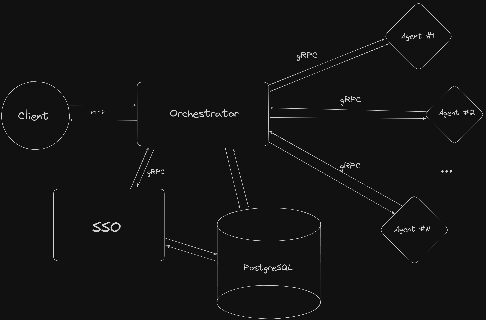

# Распределенный вычислитель арифметических выражений. Финальная задача

### Проект

Отправная точка: http://localhost:8080/

## Техническое задание
<details>
  <summary><color>ТЗ второго спринта</color></summary>
  
  Пользователь хочет считать арифметические выражения. Он вводит строку 2 + 2 * 2 и хочет получить в ответ 6. Но наши операции сложения и умножения (также деления и вычитания) выполняются "очень-очень" долго. Поэтому вариант, при котором пользователь делает http-запрос и получает в качетсве ответа результат, невозможна. Более того: вычисление каждой такой операции в нашей "альтернативной реальности" занимает "гигантские" вычислительные мощности. Соответственно, каждое действие мы должны уметь выполнять отдельно и масштабировать эту систему можем добавлением вычислительных мощностей в нашу систему в виде новых "машин". Поэтому пользователь, присылая выражение, получает в ответ идентификатор выражения и может с какой-то периодичностью уточнять у сервера "не посчиталость ли выражение"? Если выражение наконец будет вычислено - то он получит результат. Помните, что некоторые части арфиметического выражения можно вычислять параллельно.

Back-end часть

Состоит из 2 элементов:

Сервер, который принимает арифметическое выражение, переводит его в набор последовательных задач и обеспечивает порядок их выполнения. Далее будем называть его оркестратором.
Вычислитель, который может получить от оркестратора задачу, выполнить его и вернуть серверу результат. Далее будем называть его агентом.

#### Оркестратор
Сервер, который имеет следующие endpoint-ы:

- Добавление вычисления арифметического выражения.
```go
curl --location 'localhost:8080/api/v1/calculate' \
--header 'Content-Type: application/json' \
--data '{
  "expression": <строка с выражение>
}'
```
- Получение списка выражений со статусами.
```go
curl --location 'localhost:8080/api/v1/expressions'
```
- Получение выражения по его идентификатору
```go
curl --location 'localhost:8080/api/v1/expressions/:id'
```
- Получение задачи для выполнения.
```go
curl --location 'localhost:8080/internal/task'
```
- Приём результата обработки данных.
```go
curl --location 'localhost:8080/internal/task' \
--header 'Content-Type: application/json' \
--data '{
  "id": 1,
  "result": 2.5
}'
```

#### Агент
Демон, который получает выражение для вычисления с сервера, вычисляет его и отправляет на сервер результат выражения. При старте демон запускает несколько горутин, каждая из которых выступает в роли независимого вычислителя. Количество горутин регулируется переменной среды.
</details>

<details>
  <summary><color>ТЗ на финал</color></summary>
Продолжаем работу над проектом Распределенный калькулятор арифметических выражений.
В этой части работы над проектом реализуем персистентность (возможность программы восстанавливать свое состояние после перезагрузки) и многопользовательский режим.
Простыми словами: все, что мы делали до этого теперь будет работать в контексте пользователей, а все данные будут храниться в СУБД

#### Функционал
 Добавляем регистрацию пользователя
- Пользователь отправляет запрос
```go
POST /api/v1/register {
"login": ,
"password":
}
```
В ответ получае 200+OK (в случае успеха). В противном случае - ошибка

 Добавляем вход
- Пользователь отправляет запрос
```go
POST /api/v1/login {
"login": ,
"password":
}
```
В ответ получает 200+OK и JWT токен для последующей авторизации.

- Весь реализованный ранее функционал работает как раньше, только в контексте конкретного пользователя.
За эту часть можно получить 20 баллов
- У кого выражения хранились в памяти - переводим хранение в SQLite. (теперь наша система обязана переживать перезагрузку)
За эту часть можно получить 20 баллов
- У кого общение вычислителя и сервера вычислений было реализовано с помощью HTTP - переводим взаимодействие на GRPC
За эту часть можно получить 10 баллов

Дополнительные баллы:
- за покрытие проекта модульными тестами можно получить бонусные 10 баллов
- за покрытие проекта интеграционными тестами можно получить бонусные 10 баллов

Правила оформления:
- Проект размещен на github
- Проект снабжен Readme фалом - где подробно описано, о чем проект и как им пользоваться
- Проект снабжён примерами использования с помощью curl (который покрывает разные сценарии: всё хорошо, ошибки)
```go
curl --location 'localhost/api/v1/calculate' \
--header 'Content-Type: application/json' \
--data '{
  "expression": "2+2*2"
}'
```
- Отдельным блоком в документации идёт инструкция по запуску проекта (желательно, чтобы можно было просто скопировать какую-то команду и запустить ей проект)
```go
go run ./cmd/calc_service/...
```
</details>

## Запуск проекта: 
- Установите [docker engine](https://docs.docker.com/engine/install/) и [docker compose](https://docs.docker.com/compose/install/) (обязательно версию 2.24.5 и новее, иначе на Windows не будет билдить)
- Склонируйте репозиторий
```sh
git clone https://github.com/neandrson/go-daev2-final.git
```
- Перейдите в корневой каталог проекта
```sh
cd go-daev2-final
```
### Docker
Собрать приложение состоящее из оркестратора и заданных количества агентов:
```sh
docker compose build && docker compose up --scale agent=X`
```
или

 `docker compose up -d` (`docker compose up -d --scale agent=X` <- если хотите несколько (X - количество) агентов на вычисление; без флага `-d` если хотите, чтобы выводились логи докера в консоль)

Пожалуйста, дождитесь сообщения о том, что сервер начал работу.
На моей машине этот процесс занимает заметное время.

Для того, чтобы остановить запущенные контейнеры в фоновом режиме:
```sh
docker compose down
```
или `CTRC-C`, если контейнеры запущены не в фоне.

# Примеры:

се примеры рассчитаны на то, что приложение собиралось через docker compose.
В ином случае указываете порт, который прослушивает сервер - 8080.

Все примеры http запросов находятся в папке [/docs/examples](./docs/examples)

- [/docs/examples/registerUser.http](./docs/examples/registerUser.http) -> Пример запроса для регистрации пользователя
```go
POST http://localhost:8080/register HTTP/1.1

content-type: application/json

{
    "login": "example",
    "password": "really_strong_password"
}
```

- [/docs/examples/loginUser.http](./docs/examples/loginUser.http) -> Пример запроса для входа пользователя

- [/docs/examples/evaluateExpression.http](./docs/examples/evaluateExpression.http) -> Пример запроса на решение примера

- [/docs/examples/getAgentState.http](./docs/examples/getAgentState.http) -> Пример запроса на получение состояния всех демонов

- [/docs/examples/getAllExpressions.http](./docs/examples/getAllExpressions.http) -> Пример запроса на получение всех решенных (и не только) примеров для определенного пользователя

- [/docs/examples/getExpressionById.http](./docs/examples/getExpressionById.http) -> Пример запроса на получение выражения по его id

- [/docs/examples/getImpodenceKey.http](./docs/examples/getImpodenceKey.http) -> Пример запроса на получение ключа имподентности (id выражения)
## Вы можете получить данную ошибку: 

`Error response from daemon: Ports are not available: exposing port TCP 0.0.0.0:5673 -> 0.0.0.0:0: listen tcp 0.0.0.0:5673: bind: address already in use`

В этом случае вы должны поставить порт на любой другой свободный [docker-compose](docker-compose.yml)

Меняйте только проброшенные порты

Например:
- Было:
```yaml
  rabbitmq:
    container_name: rabbitmq
    image: rabbitmq:management
    ports:
    - 8081:15672
    - 5673:5672
```
- Стало:
```yaml
  rabbitmq:
    container_name: rabbitmq
    image: rabbitmq:management
    ports:
    - 8090:15672
    - 5812:5672
```

## Фронтенда нет

Фронтенда нет

# Правила для выражений

1) не должно быть никаких лишних символов
2) скобочки должны стоять правильно

# Схемки



# Как связаться
### [Мой телеграмм @Neandrs](https://t.me/neandrs)<p>